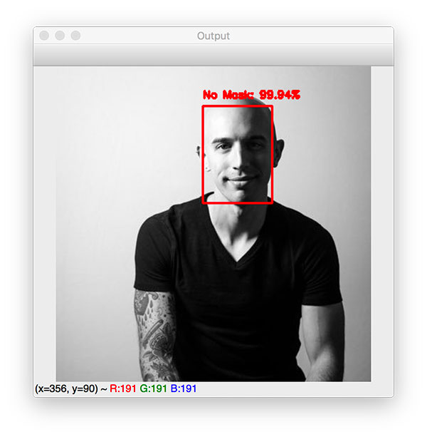

# About
> In this project, we will build a model to detect whether a person is wearing mask in real-time. 
  We will do this using the concepts of computer vision using the OpenCV library and Keras

## Team Info 

* [Abhishek patel -Team Lead](https://www.linkedin.com/in/abhishekpatelmc/)

* [Japneet Kaur Bhatia](https://www.linkedin.com/in/japneet-kaur-b-400b60194/)

## Installation

Windows:

```sh
pip install tensorflow
```

## Usage example

This project can be be used in public to detect if the person is wearning the mask or not.

 

## Work stucutre 


## Development setup

To run the code clone the repo and run..

```sh
python train.py
python test.py
```


## References

(https://towardsdatascience.com/covid-19-face-mask-detection-using-tensorflow-and-opencv-702dd833515b)

(https://www.mygreatlearning.com/blog/real-time-face-detection/)

(https://harshilp.medium.com/real-time-face-mask-detector-with-opencv-keras-tensorflow-and-deep-learning-d0744fe048c6)

## Contributing

1. Fork it (https://github.com/abhishekpatelmc/face_mask_detection.git)
2. Create your feature branch (`git checkout -b feature/fooBar`)
3. Commit your changes (`git commit -am 'Add some fooBar'`)
4. Push to the branch (`git push origin feature/fooBar`)
5. Create a new Pull Request

